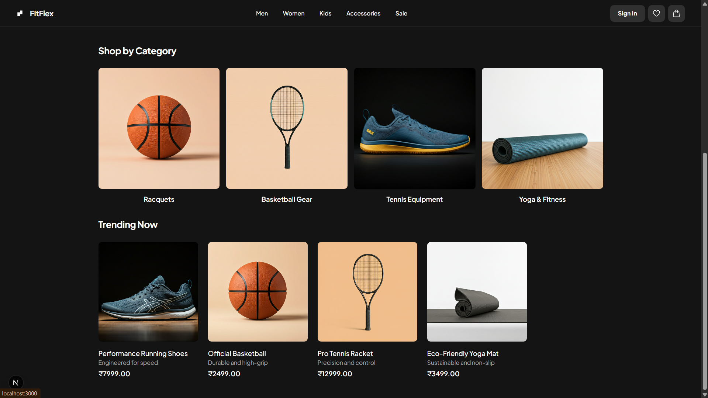

# FitFlex: Full-Stack Sports E-commerce Platform

A complete, modern e-commerce web application for sports apparel and gear, built from the ground up with a Node.js backend and a Next.js frontend.

---

## 📸 Screenshots


### Homepage


### Product Listing & Trending


### Login Page


---

## ✨ Features

### Frontend (Client-Side)
- **Modern UI/UX:** A professional and responsive design built with Next.js and Tailwind CSS.
- **Dynamic Product Pages:** Server-rendered pages for product catalogs and detailed views for fast loading and SEO.
- **Interactive Shopping Cart:** Client-side state management with React Context for a seamless cart experience.
- **User Authentication:** Complete login and registration flow with JWT-based session management.

### Backend (Server-Side)
- **RESTful API:** A complete API built with Node.js and Express for managing products, users, and orders.
- **Secure Authentication:** JWT-based authentication and secure password hashing with `bcrypt`.
- **PostgreSQL Database:** A robust and scalable database with a well-structured schema.
- **Transactional Order System:** Atomic SQL transactions ensure data integrity for all orders.

---

## 🛠️ Tech Stack

- **Frontend:** Next.js, React, TypeScript, Tailwind CSS
- **Backend:** Node.js, Express.js
- **Database:** PostgreSQL
- **Core Concepts:** RESTful APIs, JWT Authentication, State Management (React Context), Database Schema Design, Git

---

## 🚀 Getting Started

Follow these instructions to get the project running locally.

### Prerequisites
- Node.js (v18 or later)
- npm
- PostgreSQL

### Local Setup

1.  **Clone the repository:**
    ```bash
    git clone [https://github.com/Akashkumarfortuner/fullstack-sports-ecommerce.git](https://github.com/Akashkumarfortuner/fullstack-sports-ecommerce.git)
    cd fullstack-sports-ecommerce
    ```

2.  **Setup the Backend (`sports-api`):**
    ```bash
    cd sports-api
    npm install
    # Create a .env file with your PostgreSQL credentials
    # Run the database schema scripts in pgAdmin
    npm run dev
    ```

3.  **Setup the Frontend (`sports-store-ui`):**
    *Open a new terminal.*
    ```bash
    cd sports-store-ui
    npm install
    npm run dev
    ```
    Open [http://localhost:3000](http://localhost:3000) in your browser.